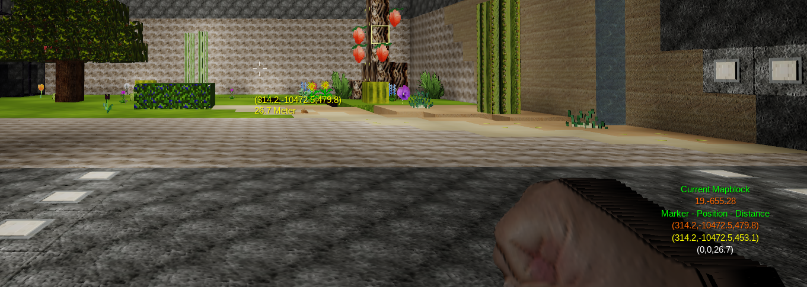

# Distancer
Client-Side-Mod for Minetest to calculate and measure Distances. 

 
## Description
This Mod helps you, to measure Distances in Minetest. 
Be carefull, this Version works only with Minetest Version 5.x.x.
 
Fully revised, more modularity and using of command-pattern.
 
## General Commands
.dis help                                 - Shows you a help of the commands. 
.dis who                                  - Shows you, who is online. 
.dis change_safe_dead <> | on | off       - Turns the automatic position-store of your dead on or off. 
.dis restore_marker                       - Swaps the old waypoint with the deadposition. 
 
## Marker Commands
.dis mark <> | -s | -m | -p | -w X,Y,Z 
.dis mark -s                              - Set's the marker to your current position. 
.dis mark -m                              - Shows you the distance between the marker anc your current position. 
.dis mark -p                              - Shows you the distance between the marker anc your current position as vector. 
.dis mark -w X,Y,Z                        - Set's the marker to the given position. 
 
## HUD Commands
.dis hud on | off                         - Turns all huds of distancer on or off. 
.dis hud_mapblock on | off                - Turns the hud for the mapblock on or off. 
.dis hud_measure on | off                 - Turns the hud to measure distances on or off. 
.dis hud_waypoint on | off                - Turns the hud for the waypoint on or off. 
 
.dis hud_set <> | -r | -w .X,.Y           - Commands for the hud-position. 
.dis hud_set <>                           - Shows the current hud-position. 
.dis hud_set -r                           - Resets the position of the hud to default. 
.dis hud_set -w 0.X,0.Y                   - Changes the position in percentage of the HUD to 0.X,0.Y. 
 
.dis hud_speed <> | -s Seconds            - Commands for the hud-update-speed. 
.dis hud_speed <>                         - Shows the current update-speed in seconds. 
.dis hud_speed -s Seconds                 - Set's the current update-delay to seconds. 
 
## for Modwriter
With the Version 2.7 or higher, the Distancer has a API for other mods. 

### Var:
dst.ver                 | Version Number of the loaded Distancer. 
dst.rev                 | Revision Number of the loaded Distancer. 
dst.name                | Name of the Mod. 

### API:
dst.send_pos(name, position)   | name = playername, position = string like "0,0,0". Set's the Marker to the Position "x,y,z". 

## License
GPL 3.0 by A.C.M. 

## depends
nothing 
 
## install 
Move the folder to your clientmods directory of your minetest-folder. 
Then activate the mod in your mods.conf. 
Important: Not the mod.conf inside the mod!! 
 
 
## Documentation for Developer
[api.md](api.md)

## Documentation as plain Text
[api.txt](api.txt)
 
